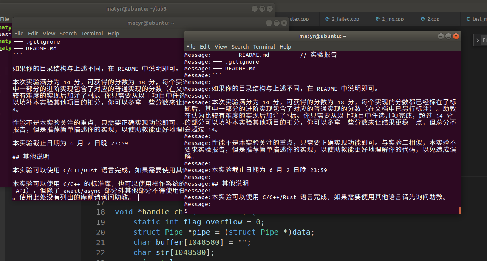

# 实验报告

陆子睦

PB20051150

## 1.cpp

编译运行方法：

```
gcc 1.c -o 1 -lpthread
./1 6666
```

```
nc 127.0.0.1 6666
```

#### 以换行符 `\n` 为分隔符接收和分割数据，并以一条消息为单位发送给另一个客户端：

实现方法是对于recv获得的buffer中的字符串，把字符串按照/n分隔，并分别send发送出去。

测试方法：直接复制粘贴带\n的文本（图为复制粘贴了实验文档）



#### 处理 `send` 无法一次发送所有数据的情况：

通过测试recv返回值是否与传入的buffer的size相等，如相等标记为一次无法完全读完。

而size传入的为1024，这样send相应发送的消息也不会太长，一定是小于1024，所以不会发送失败。

通过对字符串相应处理，可以在buffer溢出时仍然与未溢出时输出一样（通过使用缩小的buffer测试）


## 2.cpp

编译运行方法：

```
g++ 2.cpp -o 2 -lpthread 	//或g++ 2_basic.cpp -o 2_basic -lpthread
./2 6666
```

```
nc 127.0.0.1 6666
```

一开始使用的是基础版本的在send上面加锁，这样就不会同时有向fd写的操作。

这个版本为2_basic.cpp

之后使用消息队列，把消息都写入消息队列，再用单独一个线程把消息队列中的消息发给各个客户。

细粒度锁加在向消息队列写的地方。


## 3.cpp

编译运行方法：

```
g++ 3.cpp -o 3 -lpthread 
./3 6666
```

```
nc 127.0.0.1 6666
```

使用select实现基于 IO 复用/异步 IO 的多人聊天室